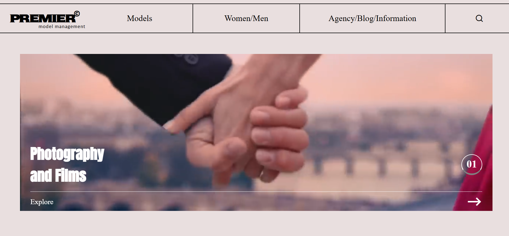
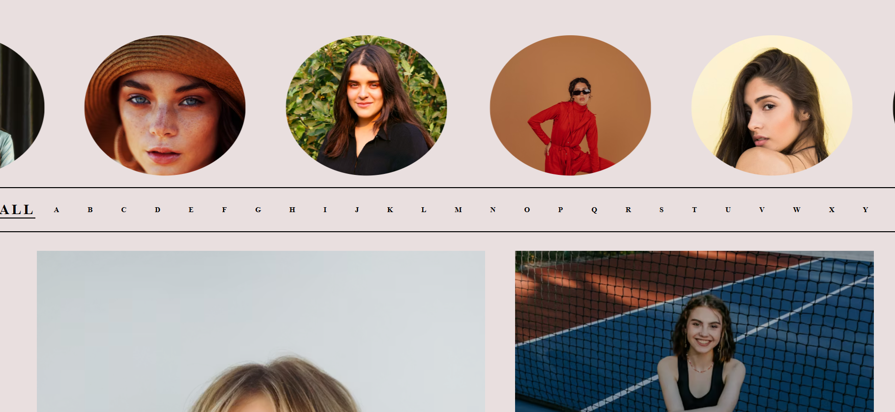
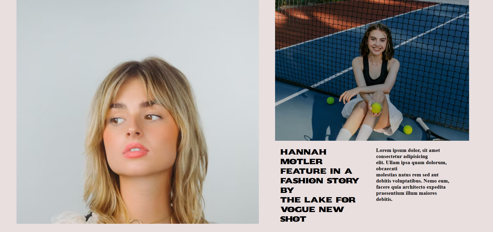
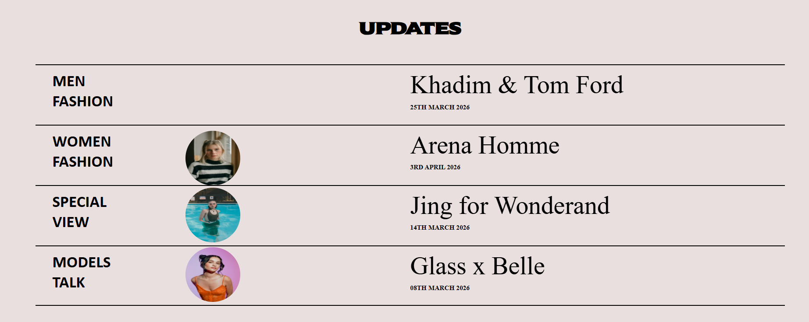
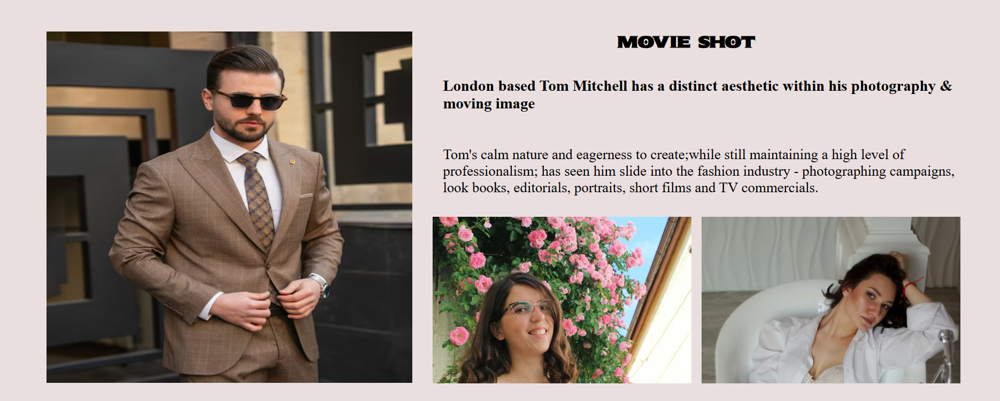

# ✨ Premier – Fashion Landing Page

A visually rich **fashion-inspired landing page** built using pure **HTML & CSS**, focusing on layout design, typography, and smooth UI sections.

This project reflects my understanding of **modern UI structuring and visual storytelling** through code.

---

## 🚀 Live Demo
 https://akshat-cs02.github.io/premier-fashion-landing-page/

---

## 📸 Preview

### Hero Section

### Model Scroll Section

### Editorial Section

### Updates Section

### Featured Layout (Page 6)

---

## ✨ Features

* 🎬 Video-based hero section with overlay content
* 🎯 Clean and structured multi-section layout
* 🔁 Horizontal scrolling model showcase
* 🧾 Editorial-style content sections
* 🎨 Strong typography and spacing control
* ⚡ CSS animations (scroll + marquee)
* 🖱️ Hover interactions

---

## ⚠️ Important Note

> This project is currently **not responsive**
> It is optimized for **desktop view only**

📌 Responsive design will be implemented in future updates.

---

## 🛠️ Tech Stack

* HTML5
* CSS3 (Flexbox, Animations)

---

## 🔧 Future Improvements

* Make fully responsive (mobile + tablet)
* Improve animation smoothness
* Refactor CSS for better scalability
* Add JavaScript for interactivity

---

## 🙋‍♂️ Author

Akshat

---

## ⭐ Support

If you like this project, consider giving it a ⭐ on GitHub!
